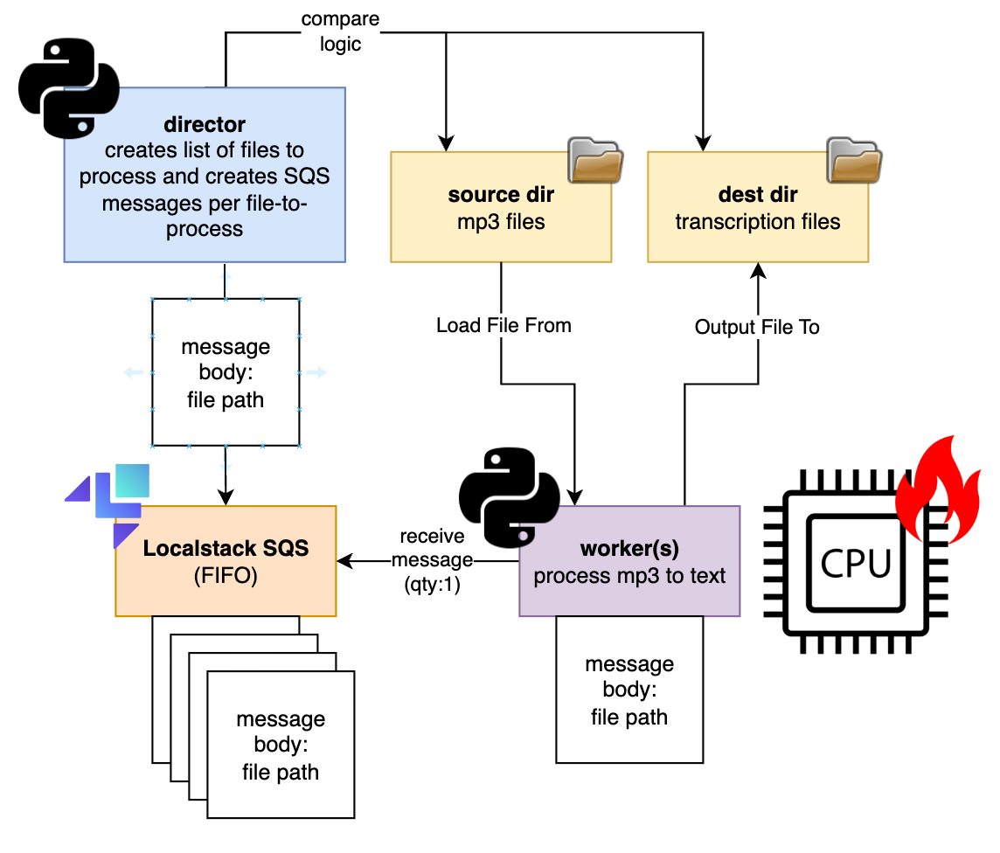

# whisper-automation
One of my long-standing tasks is to convert all my recordings of bedtime stories to transcripts, for eventually maybe writing some children's books.

This uses [Whisper](https://github.com/openai/whisper), [Localstack](https://localstack.cloud/), and some Python applications I ~~copy-pasted~~ wrote.



# Other sources
- https://github.com/ahmetoner/whisper-asr-webservice
- https://sandstorm.de/de/blog/post/automate-podcast-transcripts-with-openai-whisper.html

# active issues
- ~~director can't find /source~~ can't have quotes on compose vol paths
- ~~worker can't talk to sqs~~ docker-compose networking was wonky, using links now
- ~~worker not putting files into output dir~~ i needed to add docker-compose volumes to the paths
- ~~build.sh always destroys localstack~~ had some fun with bash functions
- sqs queue contents are a black box; no way to know what messages are in the queue, and what messages are locked for processing
- workers pulling same message : leaving this for now, only going to run one worker...this can be a future fix
  - it mostly works, had to un-async the 'act on the message' functions - the transcribe was blocking, but the message pull was not.
  - for some reason duplicates are happening;
    - one hour apart (processing time related, not specific timer...?...) (message visibility is two hours)
    - no actual output file issues
    - one took 30m to process, the other 61m
    - i think my minimal understanding of sqs messaging is the issue here...
    - message group id is static; in theory this means the messages need to be processed in order
    -
```
worker1
/source/120101_001.MP3
/source/120105_002.MP3 <-- dupe
/source/120108_001.MP3

2022-10-22 00:22:16,524 - __main__ - INFO - Received message to process: /source/120101_001.MP3
2022-10-22 00:22:16,528 - __main__ - INFO - Transcribing: /source/120101_001.MP3
2022-10-22 00:30:26,592 - __main__ - INFO - Transcribing completed for: /source/120101_001.MP3

2022-10-22 00:30:26,610 - __main__ - INFO - Received message to process: /source/120105_002.MP3
2022-10-22 00:30:26,611 - __main__ - INFO - Transcribing: /source/120105_002.MP3
2022-10-22 01:31:16,790 - __main__ - INFO - Transcribing completed for: /source/120105_002.MP3
why did this take 61 minutes...and received at 0030


2022-10-22 01:31:16,807 - __main__ - INFO - Received message to process: /source/120108_001.MP3
2022-10-22 01:31:16,809 - __main__ - INFO - Transcribing: /source/120108_001.MP3
2022-10-22 01:58:15,673 - __main__ - INFO - Transcribing completed for: /source/120108_001.MP3
2022-10-22 01:58:30,687 - __main__ - INFO - No messages in the queue, we are done here.

worker2
/source/120105_001.MP3
/source/120107_001.MP3
/source/120105_002.MP3 <-- dupe

2022-10-22 00:22:21,325 - __main__ - INFO - Received message to process: /source/120105_001.MP3
2022-10-22 00:22:21,328 - __main__ - INFO - Transcribing: /source/120105_001.MP3
2022-10-22 00:56:36,349 - __main__ - INFO - Transcribing completed for: /source/120105_001.MP3
2022-10-22 00:56:36,365 - __main__ - INFO - Received message to process: /source/120107_001.MP3
2022-10-22 00:56:36,367 - __main__ - INFO - Transcribing: /source/120107_001.MP3
2022-10-22 01:30:13,627 - __main__ - INFO - Transcribing completed for: /source/120107_001.MP3

2022-10-22 01:30:13,642 - __main__ - INFO - Received message to process: /source/120105_002.MP3
2022-10-22 01:30:13,643 - __main__ - INFO - Transcribing: /source/120105_002.MP3
2022-10-22 02:04:50,764 - __main__ - INFO - Transcribing completed for: /source/120105_002.MP3
but this only take 35 minutes..., and received an hour later?

2022-10-22 02:05:05,785 - __main__ - INFO - No messages in the queue, we are done here.
```


## worker build times are long
The worker build takes a long time (~5m) due to having to download the language model on each RUN python main.py, if not already cached.
todo: can we cache that?

